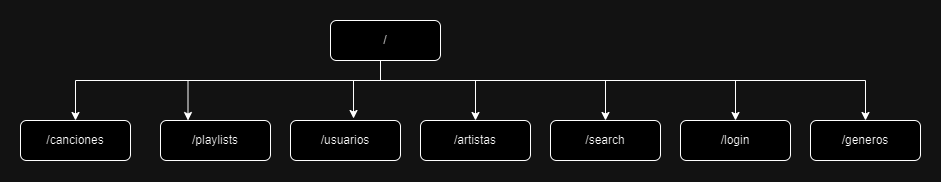
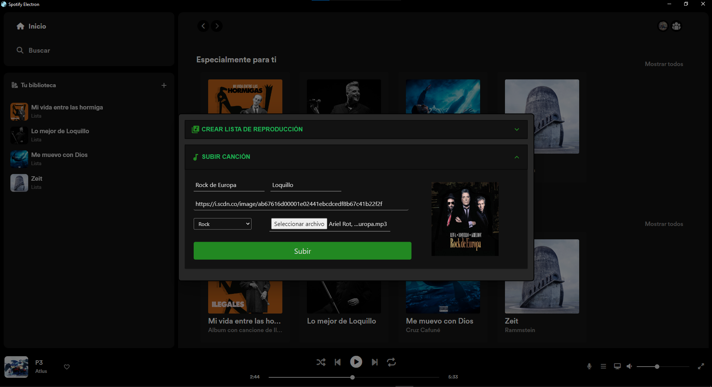
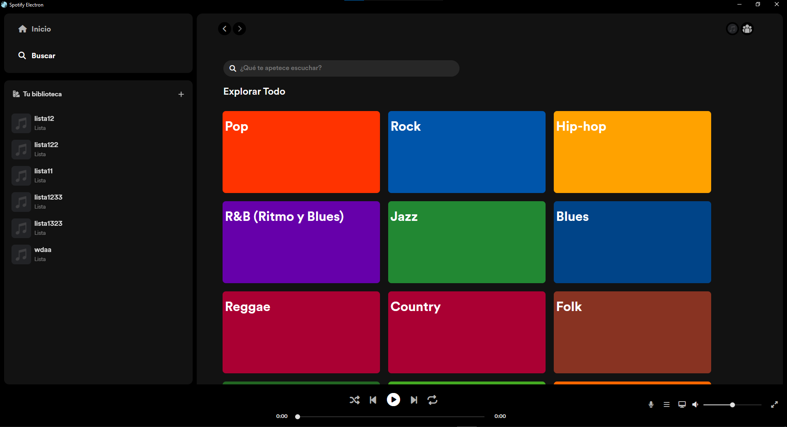

# Spotify Electron


## Website 🌐

Check our [website](https://antoniomrtz.github.io/SpotifyElectron_Web/)

## Software Architecture


### Frontend architecture


## API Endpoints



## 1. Clone the repository

```
git clone https://github.com/AntonioMrtz/SpotifyElectron.git
```


## 2. Start Electron App

```
cd SpotifyElectron/Electron;
npm install;
npm start;
```

## 3. Start Python Backend API

```
cd '.\Backend API\';
pip install -r requirements.txt;
cd src/;
python3 -m uvicorn main:app --reload;
```
**.env file is needed with**

* MONGO_PASSWORD: password of mongodb database
* SECRET_KEY_SIGN: byte key for signing tokens
* Check **.env.example** for more info

**FAQ**

* pip install -r requirements.txt || pip3 install -r requirements.txt [ Depends on python version installed ]
* API is being deployed at **http://127.0.0.1:8000/**
* Access visual API swagger documentation at  
  * **Backend API/api-docs-spotify-electron.html**
  * Or deploying the app and accessing **http://127.0.0.1:8000/docs**
## 4. Tests ✔️

### Backend

```
cd Backend API/src;
python3 -m pytest -s;
```

### Frontend

```
cd Electron/;
npm run test;
```

## 5. Containerize 🐋

### Docker

```
docker build -t spotify_electron_backend_image .

docker run -d --name spotify_electron_backend -e MONGO_PASSWORD=password SECRET_KEY_SIGN=secret-key-sign -p 8000:8000 spotify_electron_backend_image

```

---

## Project's goals 🎯

* Build from scratch a streaming service like Spotify using Electron, Python and React.
* Develop the app with the best software practices and desing the app
to be escalable and ready for quick iterations of features.
* Focus on security and code quality for delivering the user a safe experience.
* Full coverage test suite for both Backend and Frontend.
* Work with Cloud AWS services such as Lambda,S3 and Cloudfront.
* Work as a team managing Github branches, pull requests,code reviews and Trello Board to organize tasks in different stages.
* Reach CI/CD automatization with Github Actions. 
* Add new extra functionality that could improve the original app.
* Cross platform app with only one codebase.
* Build a landing page for reaching users and portray all the goals, technologies and software processes.
* Release a docker image that eases the deploy process in every deploy enviroment.


## How to Contribute to the project

[CONTRIBUTING readme](https://github.com/AntonioMrtz/SpotifyElectron/blob/master/.github/CONTRIBUTING.md)

## Walkthrough

### Home


### Playlist


### Upload Song



### Explorar



### Login


### Update Playlist


