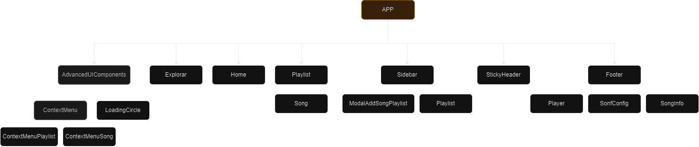
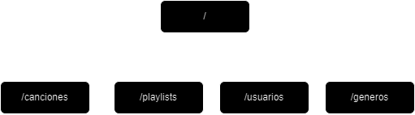

# Spotify Electron


## Software Architecture


## Frontend Component Structure



## Api Endpoints



## 1. Clone the repository

```
git clone https://github.com/AntonioMrtz/SpotifyElectron.git
```


## 2. Start Electron App

```
cd SpotifyElectron/Electron; npm install ; npm start
```

## 3. Start Python Backend API

```
cd Backend API ; pip install -r requirements.txt ; cd src/ ; python3 -m uvicorn main:app --reload
```
**.env file is needed to access the DB**

* pip install -r requirements.txt || pip3 install -r requirements.txt [ Depends on python version installed ]
* python3 -m uvicorn main:app --reload **[ API is being deployed at http://127.0.0.1:8000/ ]**
* Access visual API swagger documentation at  **http://127.0.0.1:8000/docs**

## 4. Tests

```
cd Backend API/src ; python3 -m pytest -s
```


## Project's goals

* Develop a Spotify Clone using Electron framework, Python API backend with FastAPI and React Interface.
* Add new extra functionality that could improve the original app.
* Works as a team managing Github branches, pull requests and Trello Board to organize tasks in different stages.

## How to Contribute to the project

[CONTRIBUTING readme](https://github.com/AntonioMrtz/SpotifyElectron/blob/master/.github/CONTRIBUTING.md)
