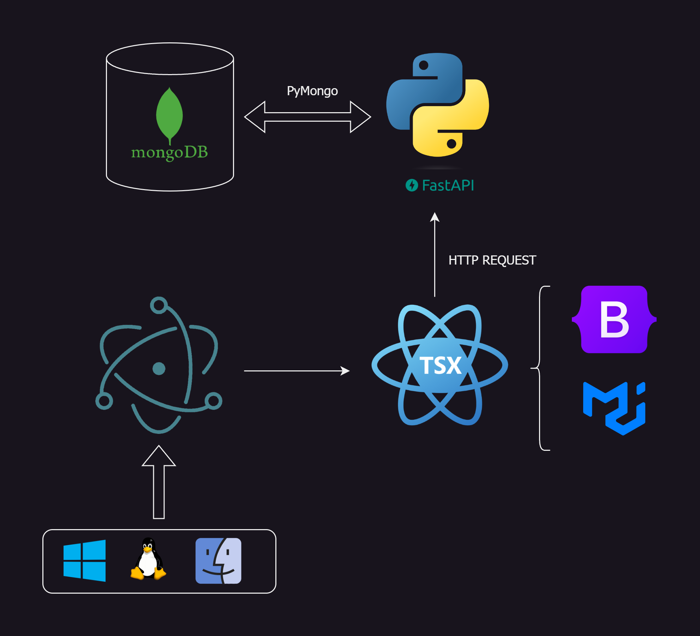

# Spotify Electron Clone

{:width="250px" height="250px"}

## Software Architecture



## Start Electron App

```
git clone https://github.com/AntonioMrtz/SpotifyElectron.git && cd SpotifyElectron/Electron
&& npm install && npm start
```

## Start Python Backend API

```
cd Backend API && pip install -r requirements.txt && python3 -m uvicorn main:app --reload
```
**.env file is needed to access the DB**

*pip install -r requirements.txt / pip3 install -r requirements.txt [ Depends on python version installed ]*
*python3 -m uvicorn main:app --reload [ API is being deployed at http://127.0.0.1:8000/ ]* <br/>
*Access visual API swagger documentation at  **http://127.0.0.1:8000/docs***


## Project's goals

* Develop a Spotify Clone using Electron framework, Python API backend with FastAPI and React Interface.
* Add new extra functionality that could improve the original app.
* Works as a team managing Github branches, pull requests and Trello Board to organize tasks in different stages.

## How to Contribute to the project

[CONTRIBUTING readme](https://github.com/AntonioMrtz/SpotifyElectron/blob/master/.github/CONTRIBUTING.md)
