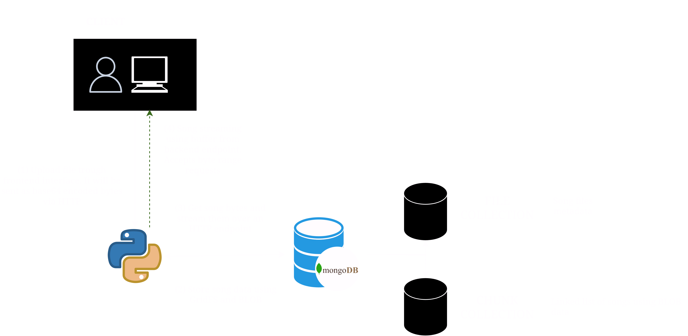

# Spotify Electron


## Overview

[Spotify Electron](https://antoniomrtz.github.io/SpotifyElectron_Web/) is a cross-platform, open-source music streaming desktop app made with Electron-React frontend and Python-FastAPI-MongoDB backend. Our goal is to replicate Spotify's core functionalities while incorporating user-requested features—such as the ability to upload personal music.

https://github.com/user-attachments/assets/1f32fa25-e99f-4cc3-8664-b21bce155934


## 🌐 Website

Check out our [website](https://antoniomrtz.github.io/SpotifyElectron_Web/). Contributions to the website can made through [its repository](https://github.com/AntonioMrtz/SpotifyElectron_Web).

## 📚 Docs

Check the [project documentation](https://antoniomrtz.github.io/SpotifyElectron_Web/docs/).

## 🔽 Download Installer

Download the [installer](https://github.com/AntonioMrtz/SpotifyElectron/releases). Follow the [instalation guide](docs/user/user-guides/Installation-Guide.md) for a more in deep explanation about installing and running the app.

## 🔧 Set up and run

### 1. Clone the repository

```console
git clone https://github.com/AntonioMrtz/SpotifyElectron.git
```

### 2. Set up and run

[⚙️ GLOBAL](docs/developer/SETUP.md)

[🖥 BACKEND](docs/developer/backend/SETUP.md)

[💻 FRONTEND](docs/developer/frontend/SETUP.md)

## 🖐 How to Contribute to the project

Are you interested in contributing to the project? Check our contributing rules and methodologies in
[our CONTRIBUTING documentation](docs/CONTRIBUTING.md). Also you can check all the contributors to the project [here](docs/CONTRIBUTORS.md).

## 🎯 Project's goals

Check our [project goals and vision](docs/VISION.md).


## 🏗️ Software Architecture

For an in-depth tour of the architecture, refer to the [architecture docs](docs/developer/Architecture.md).


### 🎵 Song Architecture



## 🤵🏼 Contributors

We're actively looking for new contributors 🙌. Feel free to check our [CONTRIBUTING documentation](docs/CONTRIBUTING.md) for more info.

<table>
    <tr>
        <td align="center">
            <a href="https://github.com/Ferbo12">
                
                <br />
                <sub><b>Ferbo12</b></sub>
            </a>
        </td>
        <td align="center">
            <a href="https://github.com/Ercamarero">
                
                <br />
                <sub><b>Ercamarero</b></sub>
            </a>
        </td>
        <td align="center">
            <a href="https://github.com/KarlosM2">
                
                <br />
                <sub><b>KarlosM2</b></sub>
            </a>
        </td>
        <td align="center">
            <a href="https://github.com/mariete1223">
                
                <br />
                <sub><b>mariete1223</b></sub>
            </a>
        </td>
        <td align="center">
            <a href="https://github.com/xiomaraR">
                
                <br />
                <sub><b>xiomaraR</b></sub>
            </a>
        </td>
    </tr>
    <tr>
        <td align="center">
            <a href="https://github.com/Javiks-P">
                
                <br />
                <sub><b>Javiks-P</b></sub>
            </a>
        </td>
        <td align="center">
            <a href="https://github.com/raulZC">
                
                <br />
                <sub><b>raulZC</b></sub>
            </a>
        </td>
        <td align="center">
            <a href="https://github.com/TalhaBinNasir">
                
                <br />
                <sub><b>TalhaBinNasir</b></sub>
            </a>
        </td>
        <td align="center">
            <a href="https://github.com/ariceron5">
                
                <br />
                <sub><b>ariceron5</b></sub>
            </a>
        </td>
        <td align="center">
            <a href="https://github.com/aarshgupta24">
                
                <br />
                <sub><b>aarshgupta24</b></sub>
            </a>
        </td>
    </tr>
    <tr>
        <td align="center">
            <a href="https://github.com/ErikMisencik">
                
                <br />
                <sub><b>ErikMisencik</b></sub>
            </a>
        </td>
        <td align="center">
            <a href="https://github.com/perig99">
                
                <br />
                <sub><b>perig99</b></sub>
            </a>
        </td>
        <td align="center">
            <a href="https://github.com/ObuMan">
                
                <br />
                <sub><b>ObuMan</b></sub>
            </a>
        </td>
        <td align="center">
            <a href="https://github.com/gigigimay">
                
                <br />
                <sub><b>gigigimay</b></sub>
            </a>
        </td>
        <td align="center">
            <a href="https://github.com/SaurabhGurde">
                
                <br />
                <sub><b>SaurabhGurde</b></sub>
            </a>
        </td>
    </tr>
    <tr>
        <td align="center">
            <a href="https://github.com/AlesSust">
                
                <br />
                <sub><b>AlesSust</b></sub>
            </a>
        </td>
        <td align="center">
            <a href="https://github.com/PavlisinPhoto">
                
                <br />
                <sub><b>PavlisinPhoto</b></sub>
            </a>
        </td>
        <td align="center">
            <a href="https://github.com/berkaykrc">
                
                <br />
                <sub><b>berkaykrc</b></sub>
            </a>
        </td>
        <td align="center">
            <a href="https://github.com/Nishantsingh11">
                
                <br />
                <sub><b>Nishant Singh</b></sub>
            </a>
        </td>
        <td align="center">
            <a href="https://github.com/vihanvt">
                
                <br />
                <sub><b>vihanvt</b></sub>
            </a>
        </td>
    </tr>
    <tr>
        <td align="center">
            <a href="https://github.com/akintewe">
                
                <br />
                <sub><b>akintewe</b></sub>
            </a>
        </td>
        <td align="center">
            <a href="https://github.com/tlorand2">
                
                <br />
                <sub><b>tlorand2</b></sub>
            </a>
        </td>
        <td align="center">
             <a href="https://github.com/Nikhil034">
                 
                 <br />
                 <sub><b>Nikhil034</b></sub>
             </a>
         </td>
         <td></td>
         <td></td>
    </tr>
 
</table>
