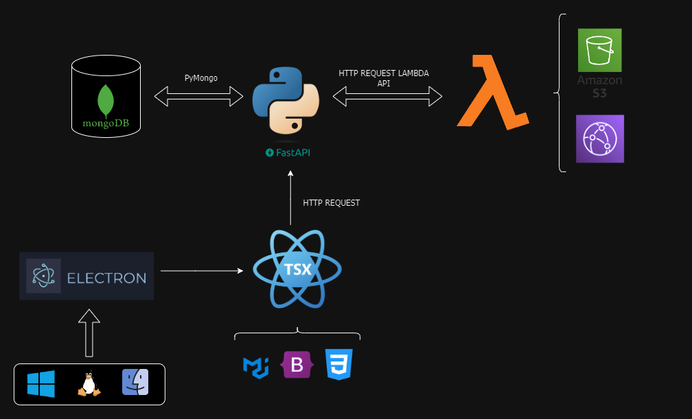
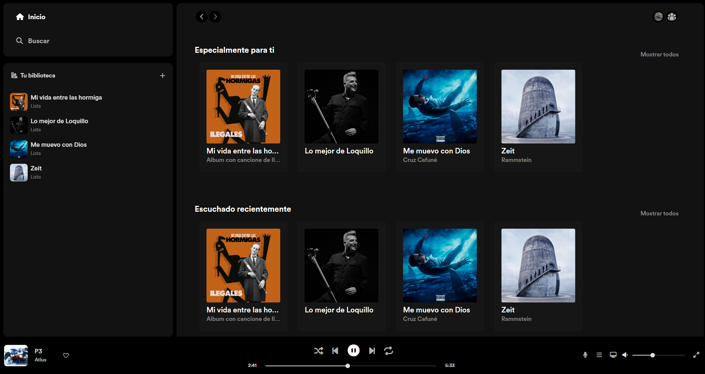
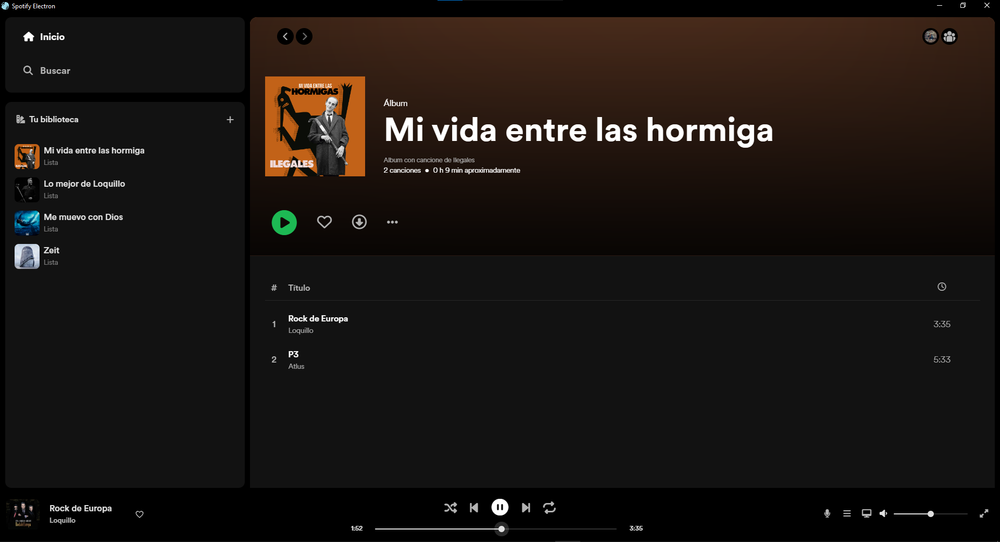
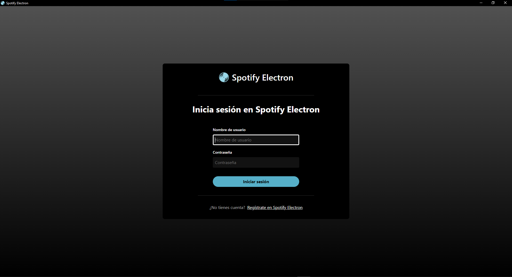

# Spotify Electron


## Overview

[Spotify Electron](https://antoniomrtz.github.io/SpotifyElectron_Web/) is a cross-platform music streaming desktop app made with Electron-React frontend and Python-FastAPI-AWS Backend. The main goal is to reproduce the original Spotify functionality while adding new one like uploading songs.

## 🌐 Website

Check our [website](https://antoniomrtz.github.io/SpotifyElectron_Web/)

## 🔽 Download Installer

Donwload the installer [here](https://github.com/AntonioMrtz/SpotifyElectron/releases)

## 🔧 Set up and run

### 1. Clone the repository

```
git clone https://github.com/AntonioMrtz/SpotifyElectron.git
```

### 2. Set up and run

[🖥 BACKEND](docs/backend//SETUP.md)

[💻 FRONTEND](docs/frontend//SETUP.md)


## 🖐 How to Contribute to the project

Are you interested in contributing to the project? Check our contributing rules and methodologies in
[CONTRIBUTING readme](.github/CONTRIBUTING.md).

## 🎯 Project's goals

Check our [project goals and vision](.github/VISION.md)

---


## Software Architecture



### Song architecture


### Frontend architecture


---

## Walkthrough

### Home



### Playlist



### Upload Song


### Explore users, artist, songs and playlists


### Login




### Update Playlist


