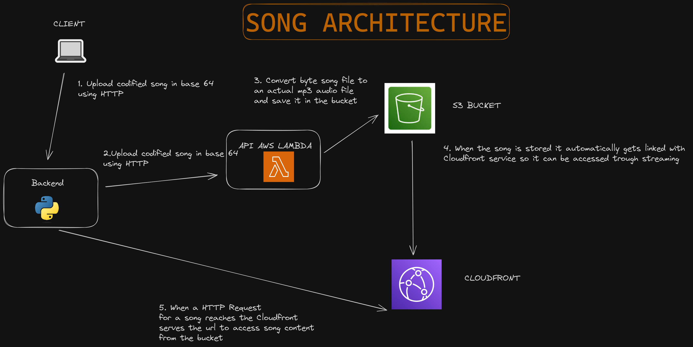

# Spotify Electron


## Website 🌐

Check our [website](https://antoniomrtz.github.io/SpotifyElectron_Web/)

## Download Installer 🔽

Donwload the installer [here](https://github.com/AntonioMrtz/SpotifyElectron/releases)

## SetUp and run 🔧

## 1. Clone the repository

```
git clone https://github.com/AntonioMrtz/SpotifyElectron.git
```

## 2. Setup and run

[🖥 BACKEND](docs/backend//SETUP.md)

[💻 FRONTEND](docs/frontend//SETUP.md)


## Software Architecture


### Song architecture



### Frontend architecture


---

## Project's goals 🎯

* Build from scratch a streaming service like Spotify using Electron, Python and React.
* Develop the app with the best software practices and desing the app
to be escalable and ready for quick iterations of features.
* Focus on security and code quality for delivering the user a safe experience.
* Full coverage test suite for both Backend and Frontend.
* Work with Cloud AWS services such as Lambda, S3 and Cloudfront.
* Work as a team managing Github branches, pull requests,code reviews and Trello Board to organize tasks in different stages.
* Reach CI/CD automatization with Github Actions.
* Add new extra functionality that could improve the original app.
* Cross platform app with only one codebase.
* Build a landing page for reaching users and portray all the goals, technologies and software processes.
* Release a docker image that eases the deploy process in every deploy enviroment.
---


## How to Contribute to the project

[CONTRIBUTING readme](https://github.com/AntonioMrtz/SpotifyElectron/blob/master/.github/CONTRIBUTING.md)

## Walkthrough

### Home


### Playlist


### Upload Song


### Explorar


### Login


### Update Playlist


