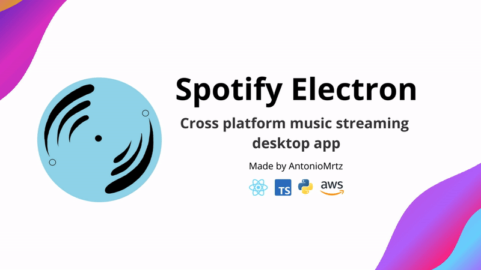

# Spotify Electron




https://github.com/user-attachments/assets/9a711ebd-3059-43df-a7ac-a94000699812


## Overview

[Spotify Electron](https://antoniomrtz.github.io/SpotifyElectron_Web/) is a cross-platform music streaming desktop app made with Electron-React frontend and Python-FastAPI-MongoDB. The main goal is to reproduce the original Spotify functionality while adding new ones like uploading songs.

## 🌐 Website

Check out our [website](https://antoniomrtz.github.io/SpotifyElectron_Web/). Contributions to the website can made through [its repository](https://github.com/AntonioMrtz/SpotifyElectron_Web).

## 📚 Docs

Check the [project documentation](https://antoniomrtz.github.io/SpotifyElectron/).

## 🔽 Download Installer

Donwload the [installer](https://github.com/AntonioMrtz/SpotifyElectron/releases). Follow the [instalation guide](docs/user/user-guides/Installation-Guide.md) for a more in deep explanation about installing and running the app.

## 🔧 Set up and run

### 1. Clone the repository

```console
git clone https://github.com/AntonioMrtz/SpotifyElectron.git
```

### 2. Set up and run

[⚙️ GLOBAL](docs/developer/SETUP.md)

[🖥 BACKEND](docs/developer/backend/SETUP.md)

[💻 FRONTEND](docs/developer/frontend/SETUP.md)

## 🖐 How to Contribute to the project

Are you interested in contributing to the project? Check our contributing rules and methodologies in
[CONTRIBUTING readme](docs/CONTRIBUTING.md). Also you can check [all the contributors](docs/CONTRIBUTORS.md) to the project.

## 🎯 Project's goals

Check our [project goals and vision](docs/VISION.md).

---

## 🏗️ Software Architecture


### 🎵 Song Architecture


## 🤵🏼 Contributors

<table>
    <tr>
        <td align="center">
            <a href="https://github.com/Ferbo12">
                
                <br />
                <sub><b>Ferbo12</b></sub>
            </a>
        </td>
        <td align="center">
            <a href="https://github.com/Ercamarero">
                
                <br />
                <sub><b>Ercamarero</b></sub>
            </a>
        </td>
        <td align="center">
            <a href="https://github.com/KarlosM2">
                
                <br />
                <sub><b>KarlosM2</b></sub>
            </a>
        </td>
        <td align="center">
            <a href="https://github.com/mariete1223">
                
                <br />
                <sub><b>mariete1223</b></sub>
            </a>
        </td>
        <td align="center">
            <a href="https://github.com/xiomaraR">
                
                <br />
                <sub><b>xiomaraR</b></sub>
            </a>
        </td>
    </tr>
    <tr>
        <td align="center">
            <a href="https://github.com/Javiks-P">
                
                <br />
                <sub><b>Javiks-P</b></sub>
            </a>
        </td>
        <td align="center">
            <a href="https://github.com/raulZC">
                
                <br />
                <sub><b>raulZC</b></sub>
            </a>
        </td>
        <td align="center">
            <a href="https://github.com/TalhaBinNasir">
                
                <br />
                <sub><b>TalhaBinNasir</b></sub>
            </a>
        </td>
        <td align="center">
            <a href="https://github.com/ariceron5">
                
                <br />
                <sub><b>ariceron5</b></sub>
            </a>
        </td>
        <td align="center">
            <a href="https://github.com/aarshgupta24">
                
                <br />
                <sub><b>aarshgupta24</b></sub>
            </a>
        </td>
    </tr>
    <tr>
        <td align="center">
            <a href="https://github.com/ErikMisencik">
                
                <br />
                <sub><b>ErikMisencik</b></sub>
            </a>
        </td>
        <td align="center">
            <a href="https://github.com/perig99">
                
                <br />
                <sub><b>perig99</b></sub>
            </a>
        </td>
        <td align="center">
            <a href="https://github.com/ObuMan">
                
                <br />
                <sub><b>ObuMan</b></sub>
            </a>
        </td>
        <td align="center">
            <a href="https://github.com/gigigimay">
                
                <br />
                <sub><b>gigigimay</b></sub>
            </a>
        </td>
        <td align="center">
            <a href="SaurabhGurde">
                
                <br />
                <sub><b>SaurabhGurde</b></sub>
            </a>
        </td>
    </tr>
    <tr>
        <td align="center">
            <a href="AlesSust">
                
                <br />
                <sub><b>AlesSust</b></sub>
            </a>
        </td>
    </tr>
</table>
