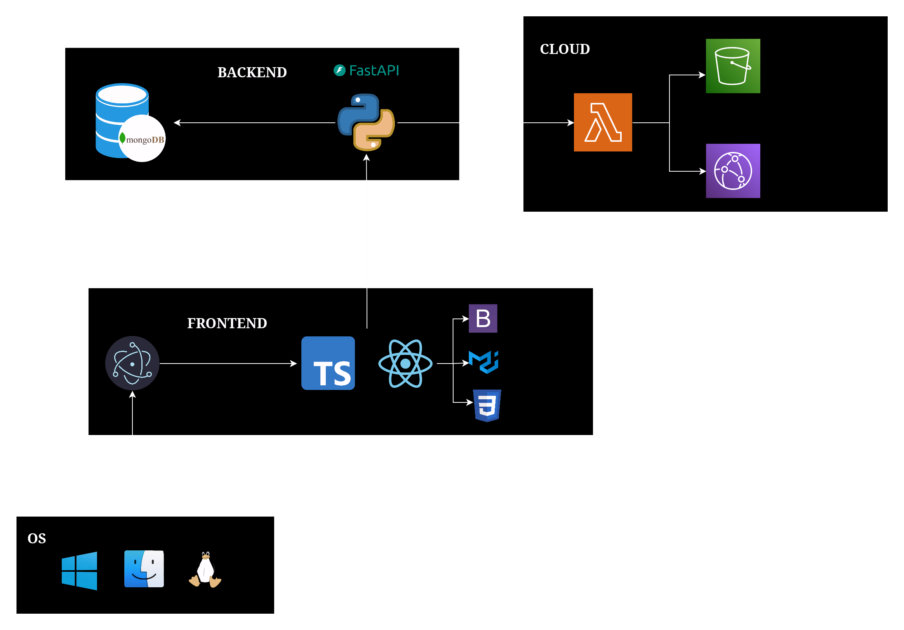

# 🏗️ Architecture

The app has two different architectures. These architectures only differ on song store, managment, serving
and playing.

* `BLOB` architecture is recommended for both production and development and only requires a MongoDB database instance.

* `SERVERLESS` architecture is also provided, it requires a serverless function to manage song resources and streaming. This architecture uses AWS Lambda as serverless function, S3 Bucket for storing songs and Cloudfront for streaming songs into the client using a URL.

## BLOB

Songs are stored using a MongoDB database using the BLOB data type and streamed directly by backend.
Songs storage is based on [GridFS specification](https://www.mongodb.com/docs/manual/core/gridfs/). Two collections are used:

* **data.files**, which stores song metadata, like the first data chunk of content and other data that
makes easier to handle songs without needing to get the full song data.
* **data.chunks**, a linked list of BLOB data that stores the song content.

Frontend has to set the following configuration in `global.ts` file:

```ts
export const songArchitecture: SongArchitecture = SongArchitecture.BLOB_ARCHITECTURE;
```

Backend has to use the following configuration in `.env`:

```console
ARCH=BLOB
```

With this configuration, frontend will load the `BLOB` architecture music player that manages the incoming
encoded base64 bytes of the song data and injects it into the music player.


### Song architecture


## SERVERLESS (deprecated)

As seen in the architecture diagram below, the song data is manage using and AWS Lambda serverless function, it
stores the data into an S3 Bucket. The stored data is linked with Cloudfront streaming service which provides
a URL that is injected into the music player for streaming the song data. Song metadata such as name, artist, streams, etc is stored in the MongoDB database instance.

Frontend has to set the following config in `global.ts` file:

```ts
export const songArchitecture: SongArchitecture = SongArchitecture.SERVERLESS_ARCHITECTURE;
```

Backend has to use the following config in `.env`:

```console
ARCH=SERVERLESS
```

### App architecture


### Song architecture

