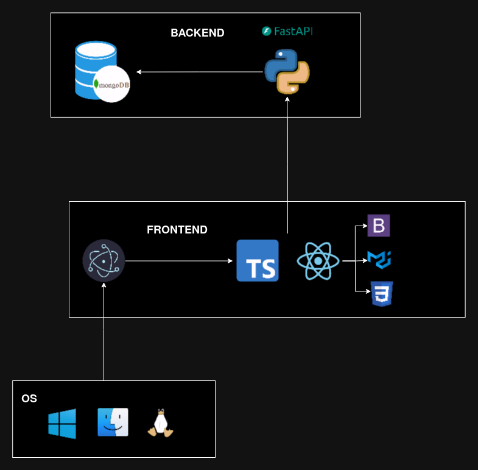

# Architecture

The app has two different architectures. These architectures only differ on song store, managment, serving
and playing. `BLOB` architecture is recommended for testing and only requires a MongoDB database instance. In production `STREAMING_SERVERLESS_FUNCTION` is used, it requires a serverless function to manage song resources and streaming. Currently the app ships with `STREAMING_SERVERLESS_FUNCTION` using AWS Lambda for serverless function, S3 Bucket for storing songs and Cloudfront for streaming songs into the client using a URL.

## STREAMING_SERVERLESS_FUNCTION

As seen in the architecture diagram below, the song data is manage using and AWS Lambda serverless function, it
stores the data into an S3 Bucket. The stored data is linked with Cloudfront streaming service which provides
a URL that is injected into the music player for streaming the song data. Song metadata such as name, artist, streams, etc is stored in the MongoDB database instance.

Frontend has to set the following config in `global.ts` file:

```
export const songArchitecture: SongArchitecture = SongArchitecture.STREAMING_ARCHITECTURE;
```

Backend has to use the following config in `.env`:

```
ARCH=STREAMING_SERVERLESS_FUNCTION
```


## BLOB

Songs are stored using a MongoDB database using the BLOB data type. Songs can be stored directly in a MongoDB database using [GridFS specification](https://www.mongodb.com/docs/manual/core/gridfs/). Where
a song is stored in the database two collections are used:

* **data.files**: stores song metadata, such as the first data chunk of content and other data that
eases handling songs without needing to get the full song data.
* **data.chunks**: linked list of BLOB data that stores the song content.

Frontend has to set the following config in `global.ts` file:

```
export const songArchitecture: SongArchitecture = SongArchitecture.FILE_ARCHITECTURE;
```

Backend has to use the following config in `.env`:

```
ARCH=BLOB
```

Using this config Frontend will load the `BLOB` architecture music player that manages the incoming
encoded base64 bytes of the song data and injects it into the music player.


